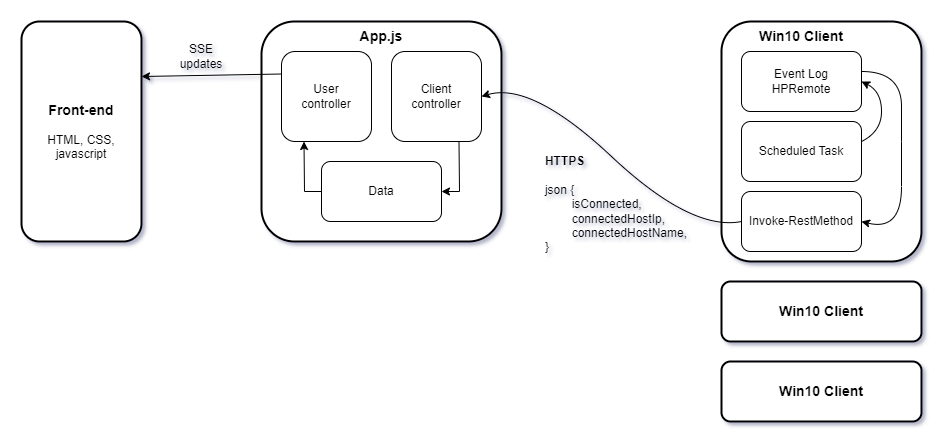

# Assist Mon

*A small web-application designed to give real-time to users about the status of HP ZCentral on host machines.*

## Description

Assist Mon is a simple Node.js web application that follows the MVC design pattern. It accepts HTTPS requests via two main routes, one from client machines, and the other from the front end user.

Client machines send status updates to the server using Powershells Invoke-RestMethod commandlet. This is executed by a scheduled task that is triggered by each new entry with a particular event ID, within the HPRemote event log. On each update, the front-end user is notified by SSE messages allowing for real-time updates to the clients status.

## Installation and use (Windows)

1. Download and install Node.js from https://nodejs.org/en/download/current
2. Download and extract files to where you want to run the app from.
3. Import your environmental variables at ``config/.env`` to set port number
4. Import self-signed certificates ``server.cert`` and ``server.key`` at ``/config``
5. Download all dependancies:
   1. In the console, navigate to the root folder
   2. Type ``npm i`` to download all dependancies
   3. Type ``npm i pm2 -g`` to install PM2 to manage to server process
6. Run the app by typing ``pm2 start app.js``

The app does not query the client machines, so an initial update need to be received from the clients. This can be done by triggering the scheduled task using PDQ/Powershell remoting.

## App diagram

## Powershell script

    [System.Net.ServicePointManager]::ServerCertificateValidationCallback = {$true}

    $logName = "HPRemote"
    $hostname = hostname

    # Use a regular expression to find the first occurrence of two digits in the hostname
    $matches = [regex]::Matches($hostname, "\d\d")

    if ($matches.Count -gt 0) {
        # Extract the third and fourth numerical characters
        $id = $matches[0].Value
    } else {
        Write-Error "No numerical characters found in the hostname."
    }

    $asstMonServerUri = "https://192.168.19.135:443/update/$id"

    # Query the HPRemote log for eventID 3 and 4
    $query = @"
    <QueryList>
        <Query Id="0" Path="$logName">
            <Select Path="$logName">*[System[(EventID=4) or (EventID=5)]]</Select>
        </Query>
    </QueryList>
    "@

    $latestEntry = Get-WinEvent -FilterXml $query -MaxEvents 1 | Select -Property Message

    # Prepare JSON
    $data = @{
        id = $id
        status = $latestEntry.Message
    }
    $data = $data | ConvertTo-Json

    # Send to Assist Mon server
    Invoke-RestMethod -Uri $asstMonServerUri -Method Post -Body $data -ContentType "application/json"
